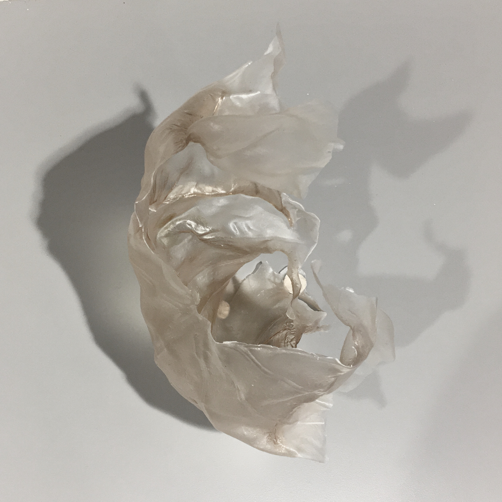
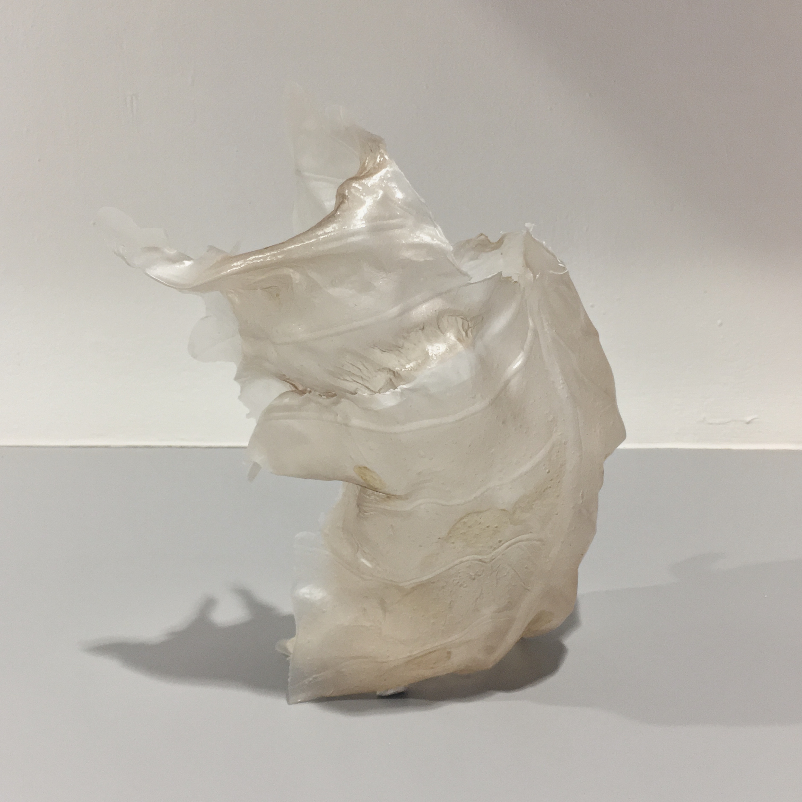
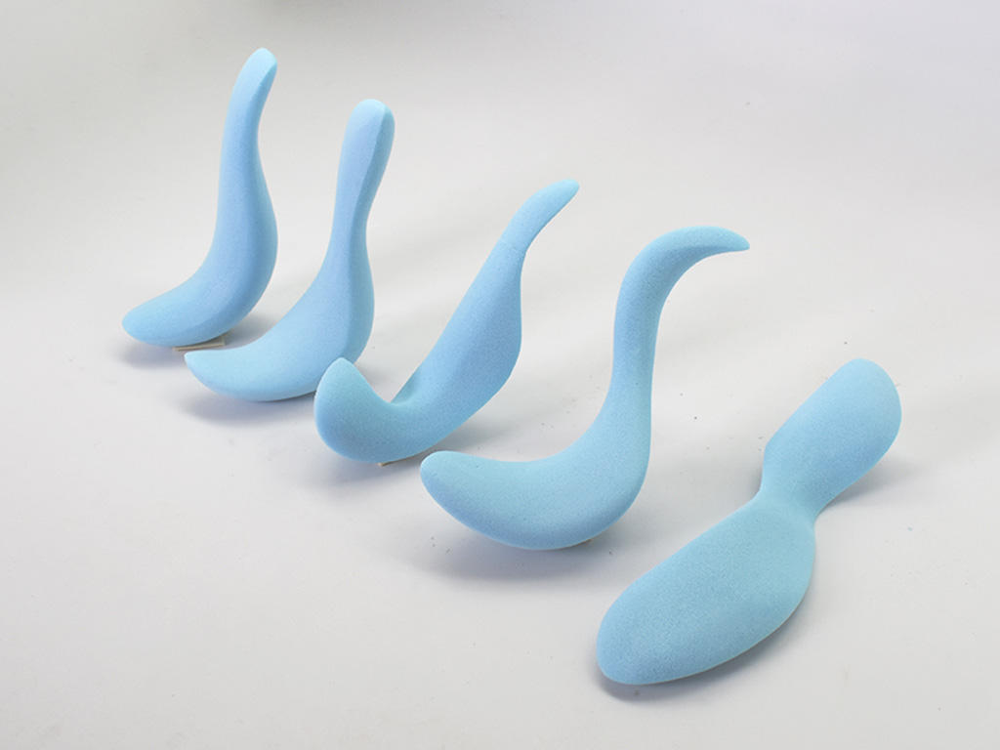

# Design?

My one semester in [Industrial Design](http://www.nus.edu.sg/nusbulletin/school-of-design-and-environment/undergraduate-education/degree-requirements/b-a-industrial-design-hons-programme/) 😀

---

## So what is Industrial Design? 🤔

--- 

#### Make stuff look pretty 💅

#### Design industrial spaces? 😵

#### Design stuff to earn money 🤑

---

<iframe src="https://www.facebook.com/plugins/video.php?href=https%3A%2F%2Fwww.facebook.com%2FMUJIPortugal%2Fvideos%2F1143946542285022%2F&show_text=0&width=476" width="476" height="476" style="border:none;overflow:hidden" scrolling="no" frameborder="0" allowTransparency="true" allowFullScreen="true"></iframe>

___

<h3>"Design refers to the will to interpret the meaning of human life and existence through the process of making things."</h3>

<cite>Kenya Hara</cite>

---

<h3>Design as an introspection</h3>

---

<h1>The Fascinating Kueh</h1>

___

___

<h3>Make a fascinating piece of cooked flour with the use of steam as its shaping tool</h3>

6 weeks ⏱

Should not be poisonous 😵

---

--- 

## Lamp Kueh?

---

## Let's do it 💪🏼

---

## Making the Kueh

<video style="margin-top: 60px;" width="1500" autoplay controls>
    <source src="kueh.mp4">
</video>

---

---

# Spinning Top

---

---

# Foam 

---

---

# Automata

---

___

# Book

---

<video style="margin-top: 60px;" width="800" autoplay controls>
    <source src="book.mp4">
</video>

___

<h3>"The ordinary that we n"</h3>

<cite>Kenya Hara</cite>

---